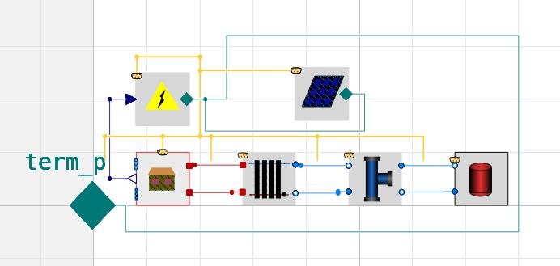

# 🔥 Trano: Automated Building Energy Simulation (BES) Model Generation 🚀
📖 **Full Documentation:** 👉 [Trano Docs](https://andoludo.github.io/trano/) 

---
**Trano** is an innovative Python package that automates the creation of complex **Building Energy Simulation (BES)** Modelica models from simplified information contained in widely used data formats like **YAML, JSON, or RDF**. Unlike traditional tools that directly convert **BIM** to **BES**, Trano introduces an intermediate step, paving the way for seamless integration with **IFC translators**.  

Trano is **Modelica library agnostic** but is natively designed to work with:  
✅ **Validated detailed Modelica libraries** (e.g., **[Buildings](https://github.com/lbl-srg/modelica-buildings)**, **[IDEAS](https://github.com/open-ideas/IDEAS)**,...)  
✅ **Reduced-order models** (e.g., **[AIXLIB](https://github.com/RWTH-EBC/AixLib)**, **ISO13790**,...)  
✅ **your library...**  

## ✨ Key Features

### 🛠️ **Built for Open-Source BES**
- Designed with **widespread adoption** in mind.
- **Optimized for OpenModelica**, but also compatible with **Dymola**.

### 🔥 **Full Thermal & Electrical Modeling**
- Generates both **thermal** and **electrical** models.
- Supports **building envelope, systems, and electricity**.
- Models:
  - **Envelope** (geometry & materials) 🏢  
  - **HVAC systems** (emission, hydronic distribution, boilers) ❄️🔥  
  - **Electrical components** (PV systems, electrical loads) ⚡  

### 🎨 **Easy to Use & Modify**
- Generates **graphical representations** of components & connections 🎭.

- Fully **modular design** for seamless modifications:
  - **Envelope** 🏠
  - **Emission** 💨
  - **Hydronic Distribution** 🚰
  - **Production & Electricity** ⚡  

### 🧩 **Extensible Component Variants**
Every Trano component (radiator, space, control, AHU, boiler, ...) is selected
by a **variant** name — switching `variant: ideal` to `variant: default`
swaps the underlying Modelica model. You can also drop your own variant
YAML files into any folder and load them via the CLI, the Python API, or the
`TRANO_VARIANTS_PATH` environment variable.

📚 **Tutorial:** [Creating and using component variants](docs/tutorials/component_variants.md)

🚀 **With Trano, creating and modifying detailed BES models has never been easier!**  

---

📖 **Full Documentation:** 👉 [Trano Docs](https://andoludo.github.io/trano/) 