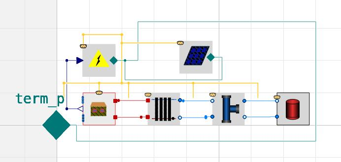

# 🔥 Trano: Automated Building Energy Simulation (BES) Model Generation 🚀
📖 **Full Documentation:** 👉 [Trano Docs](https://andoludo.github.io/trano/) 

---
**Trano** is an innovative Python package that automates the creation of complex **Building Energy Simulation (BES)** Modelica models from simplified information contained in widely used data formats like **YAML, JSON, or RDF**. Unlike traditional tools that directly convert **BIM** to **BES**, Trano introduces an intermediate step, paving the way for seamless integration with **IFC translators**.  

Trano is **Modelica library agnostic** but is natively designed to work with:  
✅ **Validated detailed Modelica libraries** (e.g., **[Buildings](https://github.com/lbl-srg/modelica-buildings)**, **[IDEAS](https://github.com/open-ideas/IDEAS)**,...)  
✅ **Reduced-order models** (e.g., **[AIXLIB](https://github.com/RWTH-EBC/AixLib)**, **ISO13790**,...)  
✅ **your library...**  

## 🧪 Supported libraries and validation

| Library | Version | Zone model | Role |
|---|---|---|---|
| [Buildings](https://github.com/lbl-srg/modelica-buildings) | 13.0.0 | `Buildings.ThermalZones.Detailed.MixedAir` | detailed, validated |
| [IDEAS](https://github.com/open-ideas/IDEAS) | 3.0.0 | `IDEAS.Buildings.Components.Zone` | detailed, validated |
| [AixLib](https://github.com/RWTH-EBC/AixLib) reduced order (`reduced_order`) | 3.0.1 | `AixLib.ThermalZones.ReducedOrder.ThermalZone` | simplified, informational |
| ISO 13790 (`iso_13790`) | AixLib 3.0.1 | `ISO13790.Zone5R1C` | simplified, informational |
| `mpc` | - | RC models (`R1C1`, `R3C2`, `R4C3`, ISO 13790) | control-oriented, CasADi ready |

The HVAC components (radiators, valves, pumps, boilers, heat pumps, air handling units) come from the Buildings
library for every Modelica library. The Modelica name of every parameter in every library is listed in the
[parameter reference](https://andoludo.github.io/trano/reference/parameters/).

The models trano generates are **validated against ASHRAE Standard 140 (BESTEST)**: the 27 single-zone cases
are simulated for a year with every library and compared with the acceptance limits of the standard and the
spread of the reference programs. Buildings and IDEAS pass every case (see the
[validation results](https://andoludo.github.io/trano/validation/bestest/) and the
[walk through the cases](https://andoludo.github.io/trano/validation/bestest_cases/)); the two simplified
zones are reported for information. Simulations run in the official OpenModelica image.

## ✨ Key Features

### 🛠️ **Built for Open-Source BES**
- Designed with **widespread adoption** in mind.
- **Optimized for OpenModelica**, but also compatible with **Dymola**.

### 🔥 **Full Thermal & Electrical Modeling**
- Generates both **thermal** and **electrical** models.
- Supports **building envelope, systems, and electricity**.
- Models:
  - **Envelope** (geometry & materials) 🏢  
  - **HVAC systems** (emission, hydronic distribution, boilers) ❄️🔥  
  - **Electrical components** (PV systems, electrical loads) ⚡  

### 🎨 **Easy to Use & Modify**
- Generates **graphical representations** of components & connections 🎭.

- Fully **modular design** for seamless modifications:
  - **Envelope** 🏠
  - **Emission** 💨
  - **Hydronic Distribution** 🚰
  - **Production & Electricity** ⚡  

### 🎛️ **Control-oriented RC models for MPC**
- `mpc` library: `trano create-model house.yaml mpc` generates simple RC models (`R1C1`, `R3C2`, `R4C3`, `ISO13790` from `Trano.MPC`) from the same building description, with the energy systems (heat pump, chiller, DHW tank, PV, battery, EV charger) inlined as CasADi-ready equations.
- `building_mpc` is **CasADi/IPOPT ready** (flat explicit ODE); `building` is directly runnable with the same weather file, solar gains, occupancy and external data as the other libraries (see the [RC models for MPC tutorial](https://andoludo.github.io/trano/tutorials/rc_model_predictive_control/)).

🚀 **With Trano, creating and modifying detailed BES models has never been easier!**  

---

📖 **Full Documentation:** 👉 [Trano Docs](https://andoludo.github.io/trano/) 