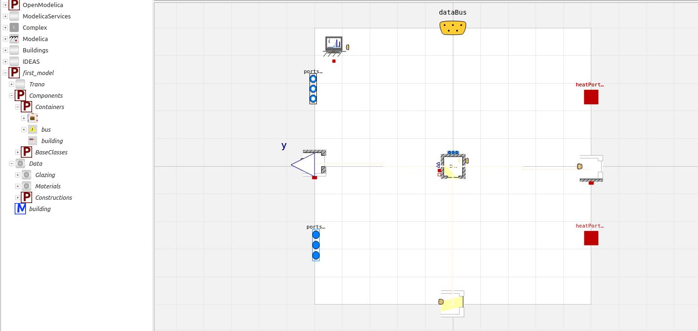

# Model with another library
Switching libraries is seamless with Trano. This tutorial demonstrates how to generate a model using the IDEAS library from the same YAML file previously utilized.

## Generate Modelica model

The only difference from the previous tutorial is that the library is specified in the command as shown below.


```python title='Test tutorials'
    from trano.main import create_model

    create_model(
        path_to_yaml_configuration_folder / "first_model.yaml",
        library="IDEAS",
    )

```
### Explanation of the Code Snippet
This code snippet imports the `create_model` function from the `trano.main` module and then calls this function to create a model based on a specified YAML configuration file.

### General Description and Parameters
- **Function**: `create_model`
- **Parameters**:
  - `path_to_yaml_configuration_folder / "first_model.yaml"`: Path to the YAML configuration file used for model creation.
  - `library="IDEAS"`: Optional parameter specifying the library to be used for model creation; defaults to "IDEAS".


The figure below illustrates the envelope subcomponent generated using the IDEAS library, in contrast to the previous tutorial that utilized the Buildings library.



