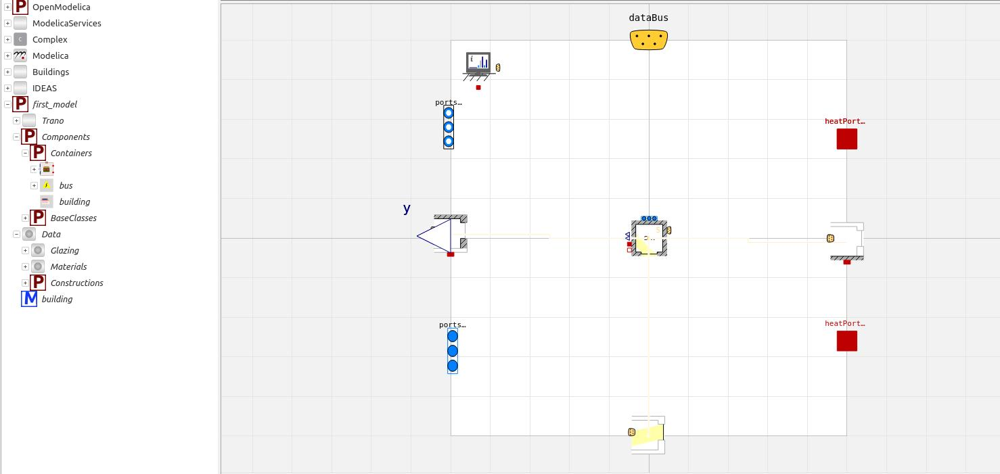

# Model with another library
Switching libraries is seamless with Trano. This tutorial demonstrates how to generate a model using the IDEAS library from the same YAML file previously utilized.

## Generate Modelica model

The only difference from the previous tutorial is that the library is specified in the command as shown below.


```python title='Test tutorials'
    from trano.main import create_model

    create_model(
        path_to_yaml_configuration_folder / "first_model.yaml",
        library="IDEAS",
    )

```
### Explanation of the Code Snippet
This code snippet imports the `create_model` function from the `trano.main` module and then calls this function to create a model based on a specified YAML configuration file.

### General Description and Parameters
- **Function**: `create_model`
- **Parameters**:
  - `path_to_yaml_configuration_folder / "first_model.yaml"`: Path to the YAML configuration file used for model creation.
  - `library="IDEAS"`: Optional parameter specifying the library to be used for model creation; defaults to "IDEAS".


The figure below illustrates the envelope subcomponent generated using the IDEAS library, in contrast to the previous tutorial that utilized the Buildings library.



## Zone template (IDEAS only)

By default Trano renders an IDEAS envelope with separate components: an `IDEAS.Buildings.Components.Zone` plus one `OuterWall`, `Window` or `SlabOnGround` array per construction. IDEAS also provides `IDEAS.Buildings.Components.RectangularZoneTemplate`, a single component bundling the zone, its four vertical faces, floor and ceiling. Set the space variant to `rectangular_zone` to use it:

```yaml
spaces:
  - id: SPACE:001
    variant: rectangular_zone
    parameters:
      floor_area: 80.0
      average_room_height: 2.5
    external_boundaries:
      external_walls:
        - surface: 90.0
          azimuth: 3.14
          tilt: wall
          construction: CONSTRUCTION:001
      floor_on_grounds:
        - surface: 80.0
          construction: CONSTRUCTION:001
      windows:
        - surface: 1.5
          azimuth: 3.14
          tilt: wall
          construction: INS2AR2020:001
```

Trano maps the walls onto the four faces of the template (face A takes the orientation shared by most surfaces, the other faces are at 90° steps from it), lumps the windows of a face sharing a glazing into one window, and uses the floor on ground as `SlabOnGround` and a horizontal roof as the ceiling. Surfaces that do not fit the rectangle (pitched roofs, a second construction or glazing on the same face, extra orientations) and the internal walls stay separate components connected through the template's `proBusExt` bus, so nothing is lost. The variant is only available with the IDEAS library.
