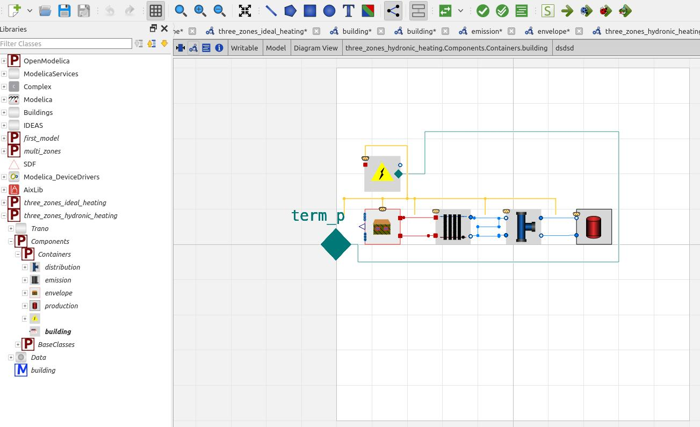
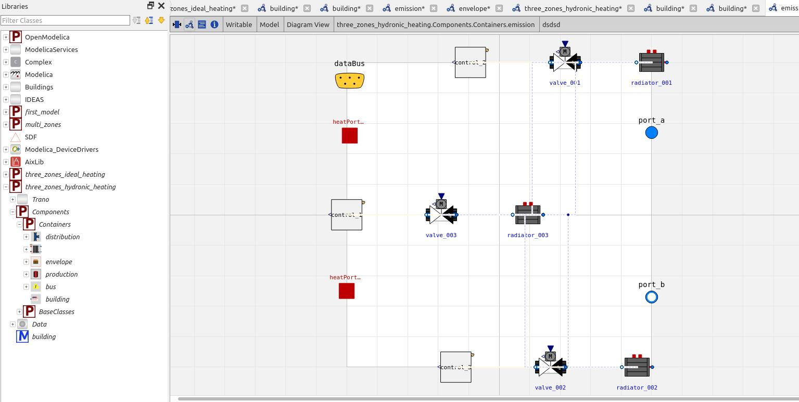
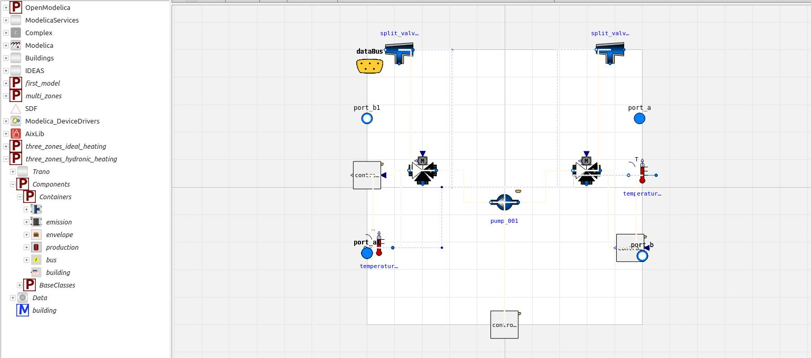
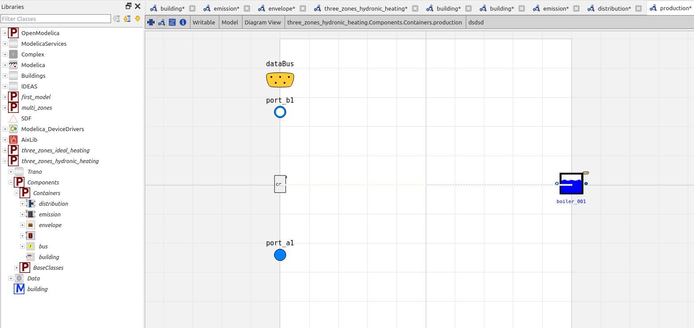

# Multi-zone with hydronic heating
The previous tutorials provided idealized examples. In this tutorial, we will simulate a three-zone building with a hydronic heating system, aiming for a more realistic model. Below, we will describe the configuration file, highlighting key points:

- **Default Construction Values**: Trano includes a set of predefined construction, glazing, and gas properties. To use these in your configuration file, add the following line:
    ```yaml
    default: !include_default
    ```

- **Emission Systems**: Each space is assigned a list of emission systems. These are linked to a radiator object (`RADIATOR:001`) and a valve object (`VALVE:001`), with the valve being used for control instead of the radiator:
    ```yaml
    emissions:
      - radiator:
          id: RADIATOR:001
      - valve:
          id: VALVE:001
          control:
            emission_control:
    ```

- **Hydronic System Definition**: A complete hydronic system must be defined, including the boiler, pump, and various valves. Default parameters will be utilized if not specified:
    ```yaml
    systems:
      - boiler:
          id: BOILER:001
          control:
            boiler_control:
      - pump:
          id: PUMP:001
          control:
            collector_control:
          outlets:
            - THREE_WAY_VALVE:001
            - THREE_WAY_VALVE:002
          inlets:
            - BOILER:001
      - split_valve:
          id: SPLIT_VALVE:001
          inlets:
            - VALVE:003
            - VALVE:001
          outlets:
            - BOILER:001
      - three_way_valve:
          id: THREE_WAY_VALVE:001
          control:
            three_way_valve_control:
          outlets:
            - TEMPERATURE_SENSOR:001
            - SPLIT_VALVE:001
      - temperature_sensor:
          id: TEMPERATURE_SENSOR:001
          outlets:
            - RADIATOR:001
            - RADIATOR:003
      - split_valve:
          id: SPLIT_VALVE:002
          inlets:
            - VALVE:002
          outlets:
            - BOILER:001
      - three_way_valve:
          id: THREE_WAY_VALVE:002
          control:
            three_way_valve_control:
          outlets:
            - TEMPERATURE_SENSOR:002
            - SPLIT_VALVE:002
      - temperature_sensor:
          id: TEMPERATURE_SENSOR:002
          inlets:
            - THREE_WAY_VALVE:002
          outlets:
            - RADIATOR:002
    ```

## Input configuration file

The described configuration represents a multi-room building designed for occupancy, featuring a combination of thermal insulation materials with consistent thermal properties. It includes three distinct spaces (rooms) with varying floor areas and heating systems. Each space has specific external wall construction types and window placements to optimize energy efficiency and natural light. The building also has a centralized heating system with a boiler, radiators, and temperature control elements to manage indoor climate effectively. Overall, it appears to be a residential or small commercial building with an emphasis on energy efficiency and heating performance.


```yaml
default: !include_default
material:
  - id: MATERIAL:001
    thermal_conductivity: 0.035
    density: 2000.0
    specific_heat_capacity: 1000.0
  - id: MATERIAL:002
    thermal_conductivity: 0.035
    density: 2000.0
    specific_heat_capacity: 1000.0
  - id: MATERIAL:003
    thermal_conductivity: 0.035
    density: 2000.0
    specific_heat_capacity: 1000.0

constructions:
  - id: CONSTRUCTION:001
    layers:
      - material: MATERIAL:001
        thickness: 0.1
      - material: MATERIAL:002
        thickness: 0.1
      - material: MATERIAL:003
        thickness: 0.1
spaces:
  - occupancy:
    parameters:
      floor_area: 49.0
      average_room_height: 2.5
    id: SPACE:001
    external_boundaries:
      external_walls:
        - surface: 20
          azimuth: 0
          tilt: wall
          construction: CAVITYWALL:001
        - surface: 30
          azimuth: 90
          tilt: wall
          construction: CAVITYWALL:001
        - surface: 50
          azimuth: 180.0
          tilt: wall
          construction: CAVITYWALL:001
      windows:
        - surface: 5.0
          construction: EPCDOUBLE:001
          azimuth: 0
          tilt: wall
        - surface: 2.0
          construction: EPCDOUBLE:001
          azimuth: 180.0
          tilt: wall
      floor_on_grounds:
        - surface: 49
          construction: CONCRETESLAB:001
    emissions:
      - radiator:
          parameters:
            nominal_heating_power_positive_for_heating: 5000
            dp_nominal: 100
          id: RADIATOR:003
      - valve:
          id: VALVE:003
          control:
            emission_control:
  - occupancy:
      parameters:
        gain: "[ 45; 90; 40 ]"
        occupancy: 3600*{16, 21}
    parameters:
      floor_area: 40
      average_room_height: 2.5
    id: SPACE:002
    external_boundaries:
      external_walls:
        - surface: 25
          azimuth: 0
          tilt: wall
          construction: CAVITYWALLPARTIALFILL:001
        - surface: 25
          azimuth: 90
          tilt: wall
          construction: CAVITYWALLPARTIALFILL:001
        - surface: 34
          azimuth: 180
          tilt: wall
          construction: CAVITYWALLPARTIALFILL:001
      windows:
        - surface: 5.0
          construction: INS2AR2020:001
          azimuth: 0
          tilt: wall
        - surface: 2.0
          construction: INS2AR2020:001
          azimuth: 180
          tilt: wall
      floor_on_grounds:
        - surface: 40
          construction: CONCRETESLAB:001
    emissions:
      - radiator:
          parameters:
            nominal_heating_power_positive_for_heating: 5000
          id: RADIATOR:001
      - valve:
          id: VALVE:001
          control:
            emission_control:
  - occupancy:
      parameters:
        gain: "[35; 70; 30]"
        occupancy: 3600*{10, 14}
    parameters:
      floor_area: 50.0
      average_room_height: 2.5
    id: SPACE:003
    external_boundaries:
      external_walls:
        - surface: 22
          azimuth: 180.0
          tilt: wall
          construction: CONSTRUCTION:001
        - surface: 17
          azimuth: 180.0
          tilt: wall
          construction: CONSTRUCTION:001
        - surface: 36
          azimuth: 180.0
          tilt: wall
          construction: CONSTRUCTION:001
      floor_on_grounds:
        - surface: 60.0
          construction: CONCRETESLAB:001
    emissions:
      - radiator:
          id: RADIATOR:002
      - valve:
          id: VALVE:002
          control:
            emission_control:
internal_walls:
  - space_1: SPACE:001
    space_2: SPACE:002
    construction: CAVITYWALL:001
    surface: 20
  - space_1: SPACE:002
    space_2: SPACE:001
    construction: CONSTRUCTION:001
    surface: 15
  - space_1: SPACE:002
    space_2: SPACE:003
    construction: CAVITYWALLPARTIALFILL:001
    surface: 22
systems:
  - boiler:
      parameters:
        nominal_heating_power: 20000
      id: BOILER:001
      control:
        boiler_control:
  - pump:
      id: PUMP:001
      control:
        collector_control:
      outlets:
        - THREE_WAY_VALVE:001
        - THREE_WAY_VALVE:002
      inlets:
        - BOILER:001
  - split_valve:
      id: SPLIT_VALVE:001
      inlets:
        - VALVE:003
        - VALVE:001
      outlets:
        - BOILER:001
  - three_way_valve:
      id: THREE_WAY_VALVE:001
      control:
        three_way_valve_control:
      outlets:
        - TEMPERATURE_SENSOR:001
        - SPLIT_VALVE:001
  - temperature_sensor:
      id: TEMPERATURE_SENSOR:001
      outlets:
        - RADIATOR:001
        - RADIATOR:003
  - split_valve:
      id: SPLIT_VALVE:002
      inlets:
        - VALVE:002
      outlets:
        - BOILER:001
  - three_way_valve:
      id: THREE_WAY_VALVE:002
      control:
        three_way_valve_control:
      outlets:
        - TEMPERATURE_SENSOR:002
        - SPLIT_VALVE:002
  - temperature_sensor:
      id: TEMPERATURE_SENSOR:002
      inlets:
        - THREE_WAY_VALVE:002
      outlets:
        - RADIATOR:002

```
            

The following code snippet demonstrates how to create the model using Trano with the IDEAS library.


```python title='Test tutorials'
    from trano.main import create_model

    create_model(
        path_to_yaml_configuration_folder / "three_zones_hydronic_heating.yaml",
        library="IDEAS",
    )

```
### General Explanation
The code snippet imports a function to create a model based on a YAML configuration file for a specific hydronic heating system. It uses a library named "IDEAS" for its functionalities.

### Parameters Description
- **path_to_yaml_configuration_folder**: 
  - Path object pointing to the directory containing YAML configuration files.
  
- **"three_zones_hydronic_heating.yaml"**: 
  - The specific YAML configuration file that defines the model parameters and settings for a three-zone hydronic heating system.

- **library**: 
  - A string that specifies the library to be used for model creation. In this case, it is set to `"IDEAS"`.


## Outputs

The figure below illustrates the building components of the generated model. In addition to the building envelope and emission sub-components, it also includes components for the hydronic distribution system and the production boiler.



Opening the emission component reveals the various radiators and valves connected to different spaces, which together compose the emission system.



The figure below illustrates the hydronic distribution system connecting the emission system to the boiler.



Since the IDEAS library was utilized, the figure below illustrates the content of the envelope sub-component that incorporates the IDEAS sub-components.



