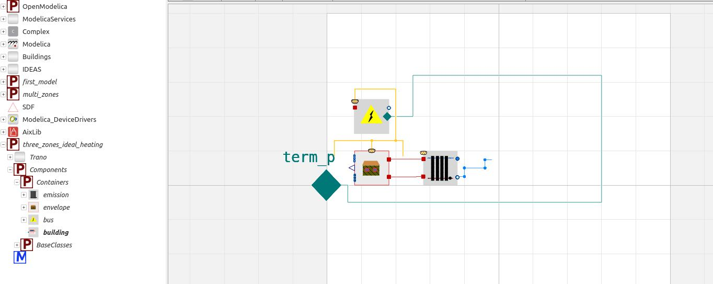

# Multi-zone with ideal heating
The previous sections focused on simulating the building envelope without a system, providing insight into constructing Trano's YAML input files. This section shifts to simulating a building with a heating system. The building consists of three zones, equipped with an ideal heating system. 

Below is the YAML configuration file describing the building's heating system. The main difference in this configuration compared to previous ones is the inclusion of a heating system in one of the building's spaces, as shown in the following YAML code snippet:

```yaml
emissions:
  - radiator:
      id: RADIATOR:001
      variant: ideal
      parameters:
        nominal_heating_power_positive_for_heating: 2500
      control:
        emission_control:
          id: EMISSION_CONTROL:001
          parameters:
            schedule: 3600*{10, 20}
            temperature_heating_setpoint: 295.15
            temperature_heating_setback: 291.15
```

The `emissions` field signifies the link to the emission system. The `variant` field specifies the type of radiator—in this case, an ideal radiator. Additionally, the `control` object of the radiator is detailed within the `control` field, where parameters like setpoints, schedule, and the heating power of the ideal radiator are defined.

## Input configuration file

The described configuration outlines a building with the following characteristics:

1. **Material Composition**: The building employs a thermal insulating construction made up of layered materials with relatively low thermal conductivity, suggesting energy-efficient design considerations.

2. **Spaces**: The building consists of multiple spaces (rooms) with varying floor areas (80 m² for a smaller room and 120 m² for larger rooms) and heights (2.5 to 2.7 meters). The internal configuration includes internal walls separating some of these spaces.

3. **Window Features**: Glazing includes double-glazed units with air in between, indicating a focus on reducing heat loss while allowing natural light.

4. **External Walls and Terrain**: The walls are insulated, and there are multiple external wall orientations with specific areas, suggesting a carefully considered design relevant to the site’s solar exposure.

5. **Heating System**: The presence of a radiator system indicates an intention for regulated indoor climate control.

In summary, this building configuration describes an energy-efficient, multi-room structure designed for controlled heating and sustainable thermal management, typical of modern residential or small commercial buildings.


```yaml
material:
  - id: MATERIAL:001
    thermal_conductivity: 0.045
    density: 2100.0
    specific_heat_capacity: 900.0
  - id: MATERIAL:002
    thermal_conductivity: 0.04
    density: 1950.0
    specific_heat_capacity: 950.0
  - id: MATERIAL:003
    thermal_conductivity: 0.038
    density: 2050.0
    specific_heat_capacity: 920.0

constructions:
  - id: CONSTRUCTION:001
    layers:
      - material: MATERIAL:001
        thickness: 0.12
      - material: MATERIAL:002
        thickness: 0.08
      - material: MATERIAL:003
        thickness: 0.1

glass_material:
  - density: 2500.0
    id: GLASS:001
    longwave_emissivity: 0.82
    shortwave_emissivity: 0.65
    specific_heat_capacity: 860.0
    thermal_conductivity: 1.1

gas:
  - density: 1.18
    id: AIR:001
    longwave_emissivity: 0.0
    shortwave_emissivity: 0.0
    specific_heat_capacity: 1005.0
    thermal_conductivity: 0.026

glazings:
  - id: INS2AR2020:001
    layers:
      - glass: GLASS:001
        thickness: 0.005
      - gas: AIR:001
        thickness: 0.014
      - glass: GLASS:001
        thickness: 0.005

spaces:
  - parameters:
      floor_area: 80.0  # Smaller room
      average_room_height: 2.5
    id: SPACE:001
    external_boundaries:
      external_walls:
        - surface: 90.0
          azimuth: 180.0
          tilt: wall
          construction: CONSTRUCTION:001
        - surface: 70.0
          azimuth: 90.0
          tilt: wall
          construction: CONSTRUCTION:001
        - surface: 160.0
          azimuth: 270.0
          tilt: wall
          construction: CONSTRUCTION:001
      floor_on_grounds:
        - surface: 80.0
          construction: CONSTRUCTION:001
      windows:
        - surface: 1.5
          azimuth: 180.0
          tilt: wall
          construction: INS2AR2020:001
          width: 1.5
          height: 1.0

  - parameters:
      floor_area: 120.0  # Larger room with different shape
      average_room_height: 2.7
    id: SPACE:002
    external_boundaries:
      external_walls:
        - surface: 120.0
          azimuth: 180.0
          tilt: wall
          construction: CONSTRUCTION:001
        - surface: 100.0
          azimuth: 90.0
          tilt: wall
          construction: CONSTRUCTION:001
        - surface: 220.0
          azimuth: 0.0
          tilt: wall
          construction: CONSTRUCTION:001
      floor_on_grounds:
        - surface: 120.0
          construction: CONSTRUCTION:001
      windows:
        - surface: 2.0
          azimuth: 180.0
          tilt: wall
          construction: INS2AR2020:001
          width: 2.0
          height: 1.2
  - parameters:
      floor_area: 120.0  # Larger room with different shape
      average_room_height: 2.7
    id: SPACE:003
    external_boundaries:
      external_walls:
        - surface: 120.0
          azimuth: 180.0
          tilt: wall
          construction: CONSTRUCTION:001
        - surface: 100.0
          azimuth: 90.0
          tilt: wall
          construction: CONSTRUCTION:001
        - surface: 220.0
          azimuth: 0.0
          tilt: wall
          construction: CONSTRUCTION:001
      floor_on_grounds:
        - surface: 120.0
          construction: CONSTRUCTION:001
      windows:
        - surface: 2.0
          azimuth: 180.0
          tilt: wall
          construction: INS2AR2020:001
          width: 2.0
          height: 1.2

    emissions:
      - radiator:
          id: RADIATOR:001
          variant: ideal
          parameters:
              nominal_heating_power_positive_for_heating: 2500
          control:
            emission_control:
              id: EMISSION_CONTROL:001
              parameters:
                schedule: 3600*{10, 20}
                temperature_heating_setpoint: 295.15
                temperature_heating_setback: 291.15

internal_walls:
  - space_1: SPACE:002
    space_2: SPACE:001
    construction: CONSTRUCTION:001
    surface: 18.0

```
            

The following code snippet demonstrates how to create a model using Trano. This process is somewhat redundant, as the interface remains consistent. The generated model is primarily derived from the YAML configuration file.


```python title='Test tutorials'
    from trano.main import create_model

    create_model(
        path_to_yaml_configuration_folder / "three_zones_ideal_heating.yaml",
    )

```
### Code Snippet Explanation
This code snippet imports a function called `create_model` from the `trano.main` module and then calls this function, passing a YAML configuration file as an argument. The configuration file likely contains parameters that define a model related to a heating system with three zones.

### General Description of Parameters
- **path_to_yaml_configuration_folder**: 
  - Presumably a variable that holds the path to the folder containing the YAML configuration files.
  
- **three_zones_ideal_heating.yaml**: 
  - Specific YAML file that contains model configurations for an ideal heating system with three zones. 

### Parameters for `create_model`
- **Configuration File Path**: 
  - The file path to the YAML file providing model specifications.


## Outputs

The figure below illustrates the building components of the generated model. In addition to the building envelope sub-component, an emissions-related component has also been generated.



Opening this component will display an ideal heating system linked to Space 3. We have defined a single heating system for one of the spaces.


Opening the building envelope component, we notice three distinct spaces defined in the model.


