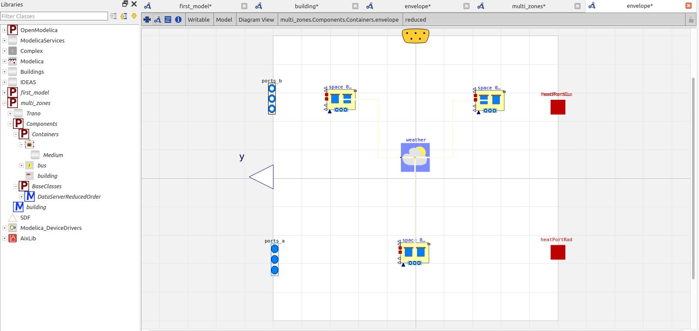

# Multizone model
Similarly to changing libraries, building a multi-zone model is as easy as adding a few lines to the configuration file. This tutorial demonstrates how to generate a model for a three-zone building.

The configuration below presents the YAML file that describes a three-zone building.

```yaml
building:
  zones:
    - name: Zone 1
      area: 500
      temperature: 22
    - name: Zone 2
      area: 400
      temperature: 21
    - name: Zone 3
      area: 600
      temperature: 23
```


```yaml
material:
  - id: MATERIAL:001
    thermal_conductivity: 0.045
    density: 2100.0
    specific_heat_capacity: 900.0
  - id: MATERIAL:002
    thermal_conductivity: 0.04
    density: 1950.0
    specific_heat_capacity: 950.0
  - id: MATERIAL:003
    thermal_conductivity: 0.038
    density: 2050.0
    specific_heat_capacity: 920.0

constructions:
  - id: CONSTRUCTION:001
    layers:
      - material: MATERIAL:001
        thickness: 0.12
      - material: MATERIAL:002
        thickness: 0.08
      - material: MATERIAL:003
        thickness: 0.1

glass_material:
  - density: 2500.0
    id: GLASS:001
    longwave_emissivity: 0.82
    shortwave_emissivity: 0.65
    specific_heat_capacity: 860.0
    thermal_conductivity: 1.1

gas:
  - density: 1.18
    id: AIR:001
    longwave_emissivity: 0.0
    shortwave_emissivity: 0.0
    specific_heat_capacity: 1005.0
    thermal_conductivity: 0.026

glazings:
  - id: INS2AR2020:001
    layers:
      - glass: GLASS:001
        thickness: 0.005
      - gas: AIR:001
        thickness: 0.014
      - glass: GLASS:001
        thickness: 0.005

spaces:
  - parameters:
      floor_area: 80.0  # Smaller room
      average_room_height: 2.5
    id: SPACE:001
    external_boundaries:
      external_walls:
        - surface: 90.0
          azimuth: 180.0
          tilt: wall
          construction: CONSTRUCTION:001
        - surface: 70.0
          azimuth: 90.0
          tilt: wall
          construction: CONSTRUCTION:001
        - surface: 160.0
          azimuth: 270.0
          tilt: wall
          construction: CONSTRUCTION:001
      floor_on_grounds:
        - surface: 80.0
          construction: CONSTRUCTION:001
      windows:
        - surface: 1.5
          azimuth: 180.0
          tilt: wall
          construction: INS2AR2020:001
          width: 1.5
          height: 1.0

  - parameters:
      floor_area: 120.0  # Larger room with different shape
      average_room_height: 2.7
    id: SPACE:002
    external_boundaries:
      external_walls:
        - surface: 120.0
          azimuth: 180.0
          tilt: wall
          construction: CONSTRUCTION:001
        - surface: 100.0
          azimuth: 90.0
          tilt: wall
          construction: CONSTRUCTION:001
        - surface: 220.0
          azimuth: 0.0
          tilt: wall
          construction: CONSTRUCTION:001
      floor_on_grounds:
        - surface: 120.0
          construction: CONSTRUCTION:001
      windows:
        - surface: 2.0
          azimuth: 180.0
          tilt: wall
          construction: INS2AR2020:001
          width: 2.0
          height: 1.2
  - parameters:
      floor_area: 59.0  # Larger room with different shape
      average_room_height: 2.7
    id: SPACE:003
    external_boundaries:
      external_walls:
        - surface: 120.0
          azimuth: 180.0
          tilt: wall
          construction: CONSTRUCTION:001
        - surface: 100.0
          azimuth: 90.0
          tilt: wall
          construction: CONSTRUCTION:001
      windows:
        - surface: 2.0
          azimuth: 90.0
          tilt: wall
          construction: INS2AR2020:001
          width: 2.0
          height: 1.2

internal_walls:
  - space_1: SPACE:002
    space_2: SPACE:001
    construction: CONSTRUCTION:001
    surface: 18.0

```
            

This time, we will utilize a reduced-order model defined in the AIXLIB library.


```python title='Test tutorials'
    from trano.main import create_model

    create_model(
        path_to_yaml_configuration_folder / "multi_zones.yaml",
        library="reduced_order",
    )

```
### Code Snippet Explanation
This code snippet imports the `create_model` function from the `trano.main` module and calls it to create a model based on the specified YAML configuration file. It uses a specified library type.

### General Description and Parameters
- **Function**: `create_model`
- **Parameters**:
  - `path_to_yaml_configuration_folder / "multi_zones.yaml"`: Path to the YAML configuration file.
  - `library`: Type of library to be used (in this case, set to `"reduced_order"`).


The figure below illustrates the envelope subcomponent generated using the reduced order building component from the [AIXLIB](https://github.com/AIXLIB) library.



