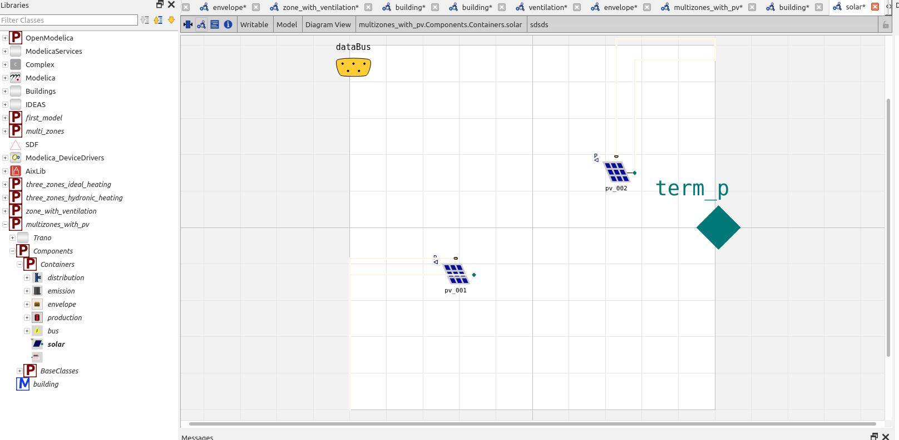

# Zone with photovoltaics
The following tutorial demonstrates how to add photovoltaic (PV) systems to buildings.


```yaml
default: !include_default
material:
  - id: MATERIAL:001
    thermal_conductivity: 0.035
    density: 2000.0
    specific_heat_capacity: 1000.0
  - id: MATERIAL:002
    thermal_conductivity: 0.035
    density: 2000.0
    specific_heat_capacity: 1000.0
  - id: MATERIAL:003
    thermal_conductivity: 0.035
    density: 2000.0
    specific_heat_capacity: 1000.0

constructions:
  - id: CONSTRUCTION:001
    layers:
      - material: MATERIAL:001
        thickness: 0.1
      - material: MATERIAL:002
        thickness: 0.1
      - material: MATERIAL:003
        thickness: 0.1
spaces:
  - occupancy:
    parameters:
      floor_area: 100.0
      average_room_height: 2.5
    id: SPACE:001
    external_boundaries:
      external_walls:
        - surface: 20
          azimuth: 0
          tilt: wall
          construction: CAVITYWALL:001
        - surface: 30
          azimuth: 90
          tilt: wall
          construction: CAVITYWALL:001
        - surface: 50
          azimuth: 180.0
          tilt: wall
          construction: CAVITYWALL:001
      windows:
        - surface: 5.0
          construction: EPCDOUBLE:001
          azimuth: 0
          tilt: wall
        - surface: 2.0
          construction: EPCDOUBLE:001
          azimuth: 180.0
          tilt: wall
      floor_on_grounds:
        - surface: 120
          construction: CONCRETESLAB:001
    emissions:
      - radiator:
          id: RADIATOR:003
      - valve:
          id: VALVE:003
          control:
            emission_control:
  - occupancy:
    parameters:
      floor_area: 70
      average_room_height: 2.5
    id: SPACE:002
    external_boundaries:
      external_walls:
        - surface: 25
          azimuth: 0
          tilt: wall
          construction: CAVITYWALLPARTIALFILL:001
        - surface: 25
          azimuth: 90
          tilt: wall
          construction: CAVITYWALLPARTIALFILL:001
        - surface: 34
          azimuth: 180
          tilt: wall
          construction: CAVITYWALLPARTIALFILL:001
      windows:
        - surface: 5.0
          construction: INS2AR2020:001
          azimuth: 0
          tilt: wall
        - surface: 2.0
          construction: INS2AR2020:001
          azimuth: 180
          tilt: wall
      floor_on_grounds:
        - surface: 60
          construction: CONCRETESLAB:001
    emissions:
      - radiator:
          id: RADIATOR:001
      - valve:
          id: VALVE:001
          control:
            emission_control:
  - occupancy:
    parameters:
      floor_area: 50.0
      average_room_height: 2.5
    id: SPACE:003
    external_boundaries:
      external_walls:
        - surface: 22
          azimuth: 180.0
          tilt: wall
          construction: CONSTRUCTION:001
        - surface: 17
          azimuth: 180.0
          tilt: wall
          construction: CONSTRUCTION:001
        - surface: 36
          azimuth: 180.0
          tilt: wall
          construction: CONSTRUCTION:001
      windows:
        - surface: 5.0
          construction: EPCDOUBLE:001
          azimuth: 180.0
          tilt: wall
      floor_on_grounds:
        - surface: 60.0
          construction: CONCRETESLAB:001
    emissions:
      - radiator:
          id: RADIATOR:002
      - valve:
          id: VALVE:002
          control:
            emission_control:
internal_walls:
  - space_1: SPACE:001
    space_2: SPACE:002
    construction: CAVITYWALL:001
    surface: 20
  - space_1: SPACE:002
    space_2: SPACE:001
    construction: CONSTRUCTION:001
    surface: 15
  - space_1: SPACE:002
    space_2: SPACE:003
    construction: CAVITYWALLPARTIALFILL:001
    surface: 22
systems:
  - boiler:
      id: BOILER:001
      variant: heat_pump
  - pump:
      id: PUMP:001
      control:
        collector_control:
      outlets:
        - THREE_WAY_VALVE:001
        - THREE_WAY_VALVE:002
      inlets:
        - BOILER:001
  - split_valve:
      id: SPLIT_VALVE:001
      inlets:
        - VALVE:003
        - VALVE:001
      outlets:
        - BOILER:001
  - three_way_valve:
      id: THREE_WAY_VALVE:001
      control:
        three_way_valve_control:
      outlets:
        - TEMPERATURE_SENSOR:001
        - SPLIT_VALVE:001
  - temperature_sensor:
      id: TEMPERATURE_SENSOR:001
      outlets:
        - RADIATOR:001
        - RADIATOR:003
  - split_valve:
      id: SPLIT_VALVE:002
      inlets:
        - VALVE:002
      outlets:
        - BOILER:001
  - three_way_valve:
      id: THREE_WAY_VALVE:002
      control:
        three_way_valve_control:
      outlets:
        - TEMPERATURE_SENSOR:002
        - SPLIT_VALVE:002
  - temperature_sensor:
      id: TEMPERATURE_SENSOR:002
      inlets:
        - THREE_WAY_VALVE:002
      outlets:
        - RADIATOR:002
solar:
  - photovoltaic:
      id: PV:001
  - photovoltaic:
      id: PV:002
```
            


```python title='Test tutorials'
    from trano.main import create_model

    create_model(
        path_to_yaml_configuration_folder / "multizones_with_pv.yaml",
        library="iso_13790",
    )

```
### General Explanation
The code snippet imports a function `create_model` from the `trano.main` module and calls it with specified parameters to create a simulation model using configurations defined in a YAML file.

### Parameters Description
- **path_to_yaml_configuration_folder / "multizones_with_pv.yaml"**
  - Path to the YAML configuration file for the model.
  - Contains setup details for a multizone model with photovoltaic (PV) systems.

- **library="iso_13790"**
  - Specifies the library to be used for the simulation.
  - In this case, it refers to ISO 13790, which pertains to energy performance of buildings.


The figure below illustrates the model generated by incorporating the PV-related subcomponent into the existing components.


Opening the solar component reveals the defined PVs assigned to the model.



