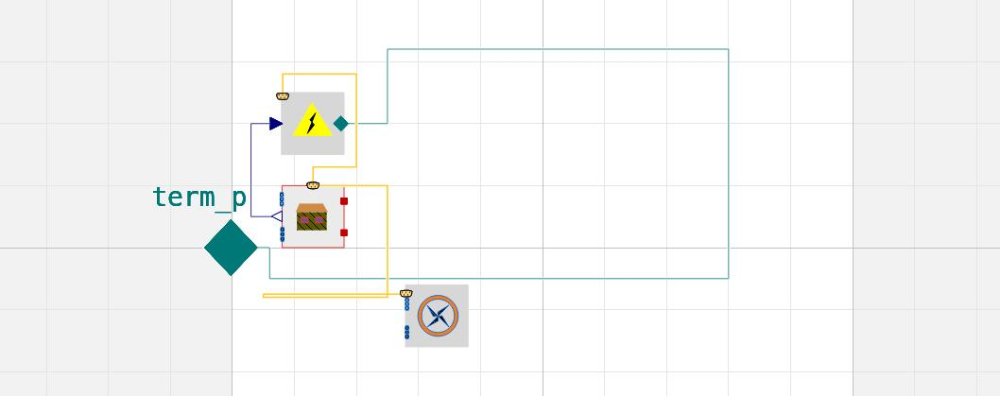
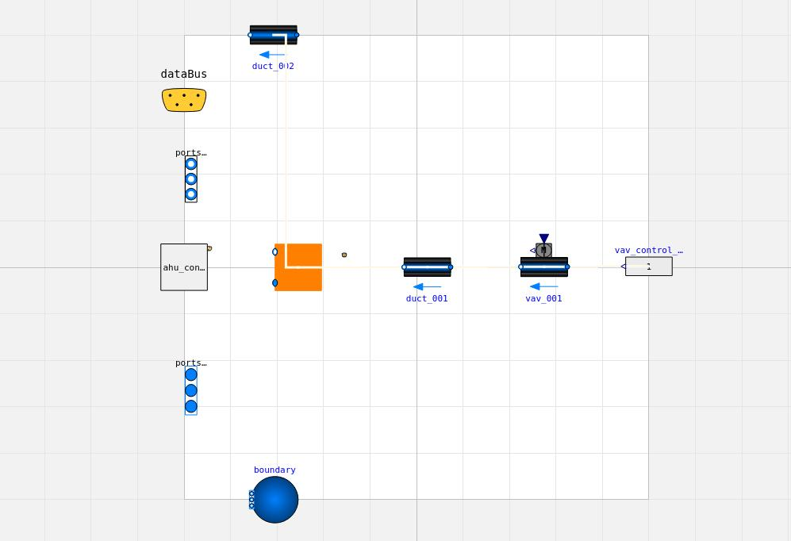

# Zone with ventilation
The tutorial below demonstrates how to add ventilation to the building model.


```yaml
default: !include_default
spaces:
  - occupancy:
      parameters:
        occupancy: 3600*{9, 17}
        gain: "[40; 75; 40]"
        heat_gain_if_occupied: 1/7/3
    parameters:
      floor_area: 100.0
      average_room_height: 2.5
    id: SPACE:001
    external_boundaries:
      external_walls:
        - surface: 20
          azimuth: 0
          tilt: wall
          construction: CAVITYWALL:001
        - surface: 30
          azimuth: 90
          tilt: wall
          construction: CAVITYWALL:001
        - surface: 50
          azimuth: 180.0
          tilt: wall
          construction: CAVITYWALL:001
      windows:
        - surface: 5.0
          construction: INS3AR2020:001
          azimuth: 0
          tilt: wall
        - surface: 2.0
          construction: INS3AR2020:001
          azimuth: 180.0
          tilt: wall
      floor_on_grounds:
        - surface: 50.0
          construction: CONCRETESLAB:001
    ventilation_inlets:
      - duct:
          id: DUCT:001
      - vav:
          id: VAV:001
          control:
            vav_control:
              id: VAV_CONTROL:001
              variant: constant

    ventilation_outlets:
      - duct:
          id: DUCT:002

systems:
  - air_handling_unit:
      id: AHU:001
      variant: test
      control:
        ahu_control:
          id: AHU_CONTROL:001
      inlets:
        - DUCT:002
      outlets:
        - DUCT:001

```
            

This time, we will utilize zone models based on ISO 13790.


```python title='Test tutorials'
    from trano.main import create_model

    create_model(
        path_to_yaml_configuration_folder / "zone_with_ventilation.yaml",
        library="iso_13790",
    )

```
### Code Snippet Explanation
This code imports the `create_model` function from the `trano.main` module and calls it to create a model based on a specified YAML configuration file and a library.

### General Description and Parameters
- **Function**: `create_model`
- **Parameters**:
  - `path_to_yaml_configuration_folder / "zone_with_ventilation.yaml"`: Path to the YAML configuration file describing the model.
  - `library="iso_13790"`: Specifies the library to use for creating the model, in this case, the ISO 13790 standard.


The figure below illustrates the generated model, highlighting the subcomponent related to ventilation.



Opening the ventilation component reveals the various elements associated with the ventilation system.



